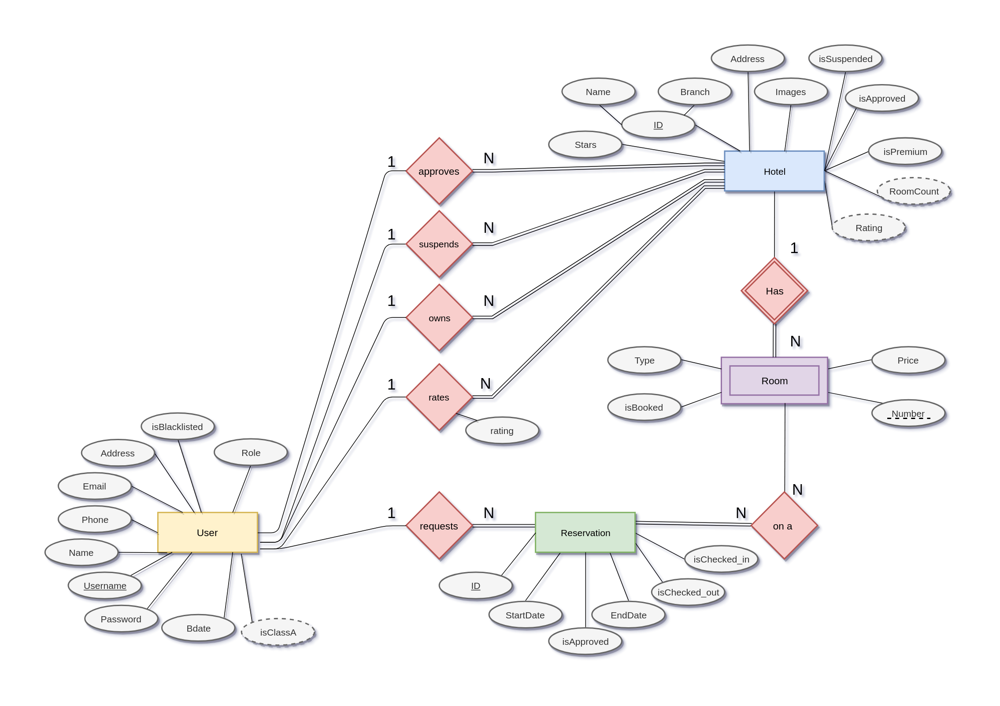
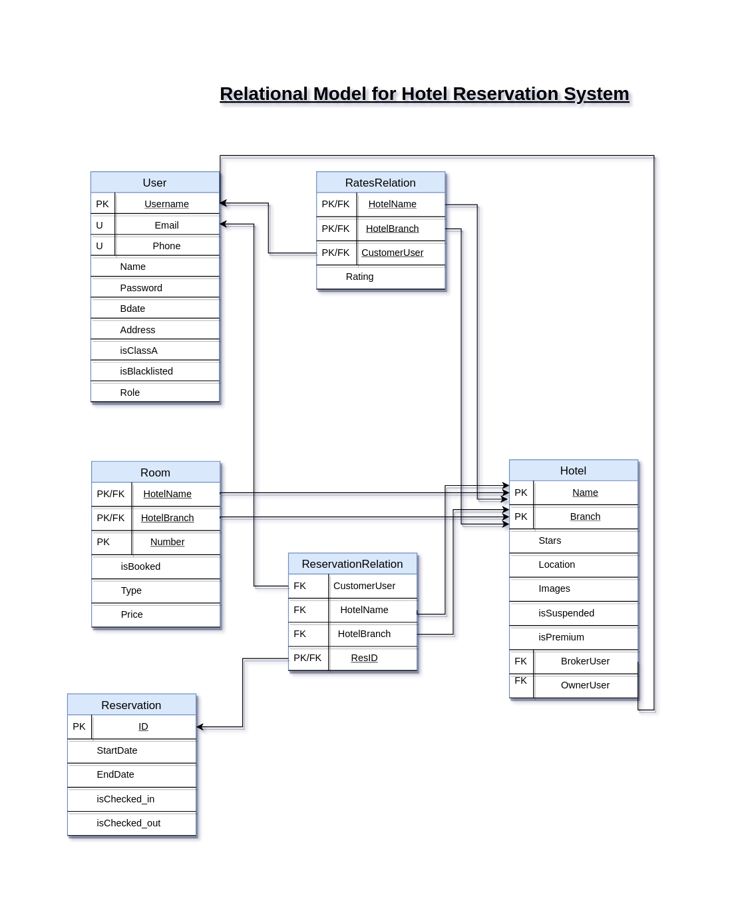
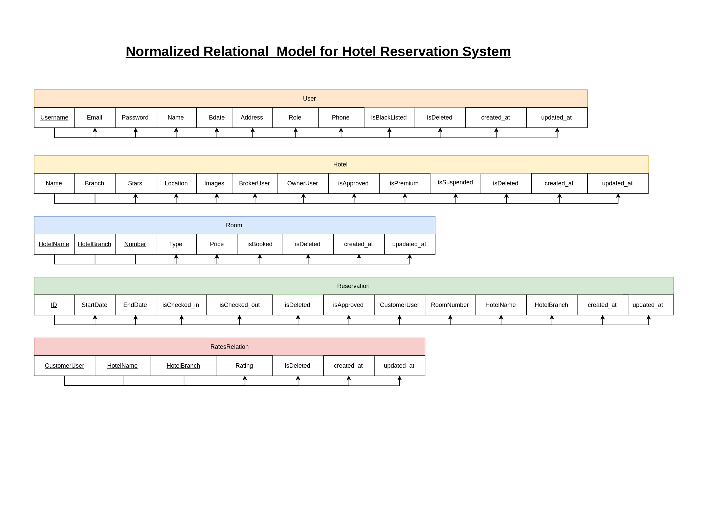

<h1 align='center'> Hotel Broker </h1>
<h4 align='center'> A Node.js web-based application hotel reservation system, that acts a broker between hotels and customers.  This team project was developed as the Database Systems course final project in Fall 2018/2019 Offering.</h4>

## Overview
A Hotel reservation system is one that allows for users to reserve rooms on hotels online, browse the hotels. 
Our system may be used by multiple brokers, multiple hotel owners and multiple users. 
During planning phase, we assumed that a Broker can own a hotel or reserve a hotel as well as the owner may book a hotel room (maybe he owns a hotel in Paris, but fancies a vacation in London). 

We have built the ER-Diagram by breaking everything down to its core meaning in the physical world and doing our best to fit it with its useful data in our miniworld.  The ER/Relational and normalization figures were created via [google’s tool draw.io](https://www.draw.io/).

---

## Database Design
This is a database course final project, so obviously the database design is the most important aspect of the project. Three steps are included here, we start by showing our ER-Diagram or the conceptual modeling. We then move to the relational model converting it from the ERD and finally we normalize it several levels to reach the normalized relational model we implement.

### Step 1: Conceptual Modeling

### Step 2: Relational Modeling

### Step 3: Normalization of Relational Model

---

## Web Application Implementation

We list below our core choices to build the web-based application:
- Used **Node.js** as an application server. [Fast, Scalable, and reliable]
- Used **MySQL** as a SQL database server. [SQL Choice was obvious since one of the project goals was to practice relational models]
- Used **Ejs** as a templating engine for the frontend. [Easier choice when it comes to frontend since this was not a main learning goal]

Next, we list the file structure of the application for convience:

├── backend  
│   ├── db  
│   │   ├── Queries  
│   │   │   ├── DatabaseDefinition  
│   │   │   ├── HotelTable  
│   │   │   ├── RatesRelationTable  
│   │   │   ├── ReservationTable  
│   │   │   ├── RoomTable  
│   │   │   └── UserTable  
│   │   ├── QueryHandlers  
│   │   │   ├── DatabaseDefinitionHandler  
│   │   │   ├── Helpers  
│   │   │   ├── HotelTable  
│   │   │   ├── RatesRelationTable  
│   │   │   ├── ReservationTable  
│   │   │   ├── RoomTable  
│   │   │   └── UserTable  
│   │   └── seed  
│   │       ├── hotelRooms  
│   │       └── reservations  
│   ├── routes  
│   └── translations  
└── views  
    ├── pages  
    │   └── CSS  
    └── partials  
        └── CSS  

Lastly, we mention that we have built wire-frames for the whole website design taht we worked on and it can be found in [this folder](docs/wire-frames/).

## Team Acknowledgments

- Amr Elzawawy [@Elzawawy](https://github.com/Elzawawy)
- Amr Ramadan   [@amramdan](https://github.com/amramadan)
- Ismail Elyamany [@IsmailElYamany](https://github.com/IsmailElYamany)
- Rami Khafagi [@ramikhafagi96](https://github.com/ramikhafagi96)
- Mohamed Tarek [@mohamedtaarek](https://github.com/mohamedtaarek)

---

<h3 align='center'>Made with :heart:</h3>
